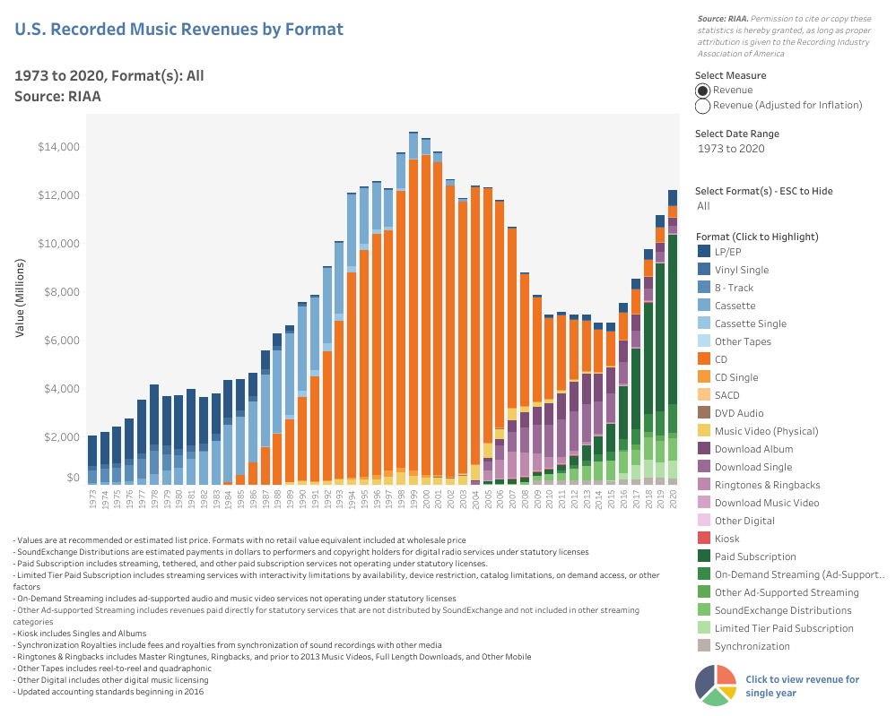

```{r setup, include=FALSE}
knitr::opts_chunk$set(echo = TRUE)
```

<br>
<br>

"_[The Recording Industry Association of America (RIAA)](https://www.riaa.com/) provides the most comprehensive data on U.S. recorded music revenues and shipments dating all the way back to 1973. This is the definitive source of revenue data for the recorded music industry in the United States._" 

RIAA provides a figure on "_U.S. Recorded Music Revenues by Format_" at its [sales database](https://www.riaa.com/u-s-sales-database/), as also given below:


```{r, echo=F, out.heigth="70%", out.width="100%", fig.link='https://public.tableau.com/views/U_S_RecordedMusicRevenuesbyFormat_0/RevenuesbyFormat?:embed=y&:embed_code_version=3&:loadOrderID=0&:display_count=y&:origin=viz_share_link', fig.align='center', fig.align='center'}

```

At a [linked page](https://www.riaa.com/wp-content/uploads/2021/02/2020-Year-End-Music-Industry-Revenue-Report.pdf), RIAA also discusses some revenue statistics for year-end 2020, since it is well-known that the music industry has been severely affected by Covid-19 due to cancellations of tours, closure of retail stores, and many other disruptions.


<br>
**Questions:**
<br>
<ol>
<li>
Please visit https://public.tableau.com/shared/4Z36JM5NN?%3AshowVizHome=no and **download** the **full** "US Music Revenue" data with the help of download button (with an arrow pointing down) at bottom right, **save** the file in your Homework_I `R` project, and then import it into your current `R` session (Hint: If you run into a problem while reading in the data, converting the file type from `.csv` to `excel` may solve the issue).
</li>
<li>
Pick _Year (copy)_, _Format_, _Value (Actual)_ variables, rename them as _Year_, _Format_, and _Value_, respectively. Get a subset of the data based on the year greater than or equal to 2018. Then sort by _Year_. [The Figure 1](https://www.riaa.com/wp-content/uploads/2021/02/2020-Year-End-Music-Industry-Revenue-Report.pdf) gives us the retail values in 2018, 2019, and 2020, respectively. Calculate these yearly retail values from your subset data and print out the output table.  
</li>
<li>
[The report](https://www.riaa.com/wp-content/uploads/2021/02/2020-Year-End-Music-Industry-Revenue-Report.pdf) says that "Streaming music revenues grew 13.4% to $10.1 billion in 2020." If _Paid Subscription_, _On-Demand Streaming (Ad-Supported)_, _Other Ad-Supported Streaming_, _SoundExchange Distributions_, and _Limited Tier Paid Subscription_ fall into the category of "Streaming", calculate and show that their total in 2020 is approximately 10.1 billion.  Print out the output table. 
</li>
<li>
[The report](https://www.riaa.com/wp-content/uploads/2021/02/2020-Year-End-Music-Industry-Revenue-Report.pdf) also says that "Streaming’s share of total revenues has
continued to grow, reaching 83% in 2020." If _Paid Subscription_, _On-Demand Streaming (Ad-Supported)_, _Other Ad-Supported Streaming_, _SoundExchange Distributions_, and _Limited Tier Paid Subscription_ fall into the category of "Streaming", 	
_Synchronization_ falls into the category of "Synchronization", _LP/EP_ and _CD_ fall into the category of "Physical", _Download Album_ and _Download Single_ fall into the category of "Digital Downloads", and the remaining ones fall into the category of "Other", calculate and show the share of each category in terms of percentage. Round the percentages up to 2 digits (Hint: The share of Streaming must be around 83%).	Print out the output table. 
</li>
<li>
Reproduce the Figure 5 in [here](https://www.riaa.com/wp-content/uploads/2021/02/2020-Year-End-Music-Industry-Revenue-Report.pdf).
</li>
</ol>


**Cautionary notes**: 
1) Homework assignments are individual-based studies. For that reason, students are expected to do homework assignments by themselves (**I will also check your commit history to see the evolution of the homework over time**). Homework assignments will not be accepted after deadline. There is **NO** make-up for missed homework.
2) You should clone `Homework I-R Project` on `GitHub` into your local computer, do the changes as needed, delete all the files you have not used to produce your homework, then render the `.Rmd` file to .pdf and finally commit and push all the required files (including `.Rmd` files) by
November 15, 2021 18:00 via [GitHub Classroom of MAT381E-Fall21](https://github.com/MAT381E-Fall21) organization.
